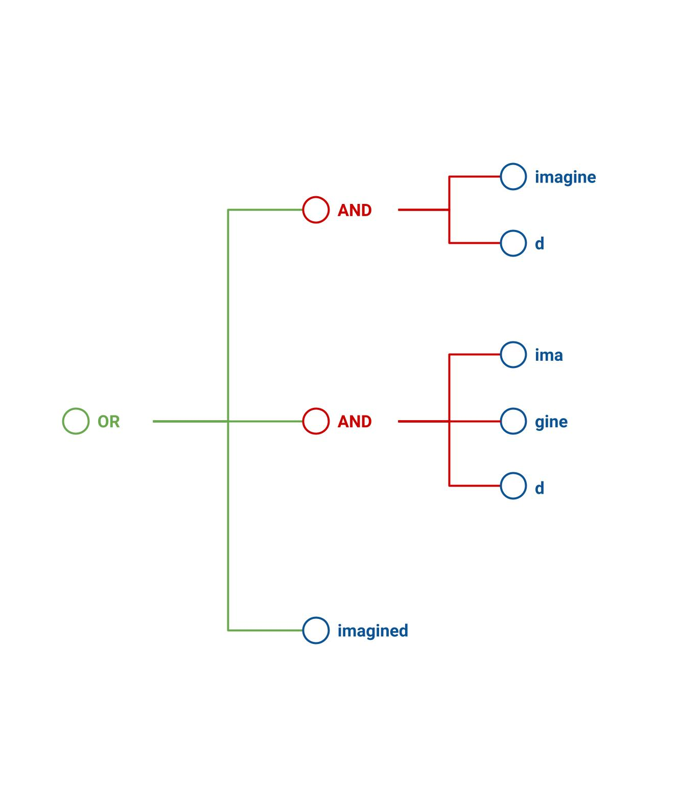

# [fit] How
# [fit] MeiliSearch
# [fit] works?

---

# What's inside?

We have a songs database with _100 000_ documents.

Those documents are stored under small internal ids.

Documents are composed of _3_ fields:
 - the song _title_
 - the name of the _artist_
 - the _release year_

---

# Placeholder Search

That's easy, we pick the `n` first internal ids from our database.

We returns the documents associated with the internal ids to the user.

---

# Faceted Search

Imagine that the user asked only for _John Lennon_ songs released between _1957_ and _1975_.

Because the _artist_ and _release year_ are faceted, that means that we have every facet values associated with the related internal ids.

Note that facet values are ordered.

---

# Faceted Search

 1. Get the internal ids stored under that _artist_ equal to  _John Lennon_.
 1. Do an union of all the ids stored under the _release year_ between _1957_ and _1975_.
 1. Do the intersection between ids found at step _1_ and _2_.

We returns the documents associated with those internal ids to the user.

---

# Search Query

 1. Extract the words from the query.
 1. Construct a query tree from those words.
 1. Construct the criteria list.
 1. Run the criteria using the query tree.
 1. Return the documents to the user. 🎉

---

# Search Query
## Construct the query tree

Imagine that a user try to search for _imagine d_. Where _d_ is a prefix word.

 1. We extract the words from the user query.
 1. Compute and fetch the derivate words.
   - ngrams (_imagined_).
   - split (_ima_ _gine_).
   - synonyms.

---

# Search Query
## Introduce what's a criterion

A criterion takes a bunch of internal ids as input, all those ids are considered equal.

The job of a criterion is to rank ids by returning subsets of those ids, in order.

---

# Search Query
## The default set of criteria

 1. The _Words_ criterion: the _more words_ the better.
 1. The _Typo_ criterion: the _less number of typos_ the better.
 1. The _Proximity_ criterion: the _nearest the query words_ are the better.
 1. The _Desc(release year)_ criterion: the _most recent_ the documents the better.

---

# Search Query
## Run the criteria list

 1. We ask documents the last criterion in the list.
 1. This criterion must ask its parent the bucket of documents.
 1. The answered documents are _sort_ and returned in _buckets of equal score_ using the query tree.

---

# Search Query
## Interpret the query tree

 1. Fetch the internal ids associated with each query word.
 1. Do the unions and intersection depending on the query tree shape.

---

# [fit] Questions?

---

# [fit] Data
# [fit] Structures

---

# The Inverted Index
## What's that?

We list all the words from the documents in the database.

We associate each of these words to the list of documents ids that contains them.

---

# The Inverted Index
## Where do we use this?

This is the kind of data structure that we use for facets.

This is also used when we need to fetch the documents associated with the words in the query tree.

---

# The Word Dictionnary
## What's that?

This is the list of all the words in the whole database.

It has a lot of interresting properties:

 1. It is _compressed_ and _lazily uncompressed_.
 1. It can return a subset of words matching a _levenshtein_ rule.
 1. It can return all the words that _starts with a given prefix_.

---

# The Word Dictionnary
## Where do we use this?

We use it anytime we need to fetch the derivate words from the query tree.

Mainly used in the _Typo_ criterion to fetch typo derivations using the _levenshtein_ algorithm.

---

# [fit] Indexing
# [fit] Documents

---

---

# Process Task

 1. Each thread is assigned a list of documents to index.
 1. Data extracted from the documents is written to disk, in parallel.
 1. Once the indexing process is finished, all the disk files are merged into a final one.
 1. This final file is written to the database.

---

# [fit] The
# [fit] End

---

# The _Words_ criterion

 1. Fetch the internal ids associated with each query word.
 1. Do the unions and intersection depending on the query tree shape.
 1. If not enough documents are found, remove the last query word.

---

# The _Typo_ criterion

 1. Fetch the internal ids associated with each query word without any typo.
 1. Do the unions and intersection depending on the query tree shape.
 1. If not enough documents are found, rerun step 1 and accept one more typo.

---

# The _Proximity_ criterion

 1. For each `AND` operation we find the documents with all those words at a proximity of one.
 1. Do the unions and intersection depending on the query tree shape.
 1. If not enough documents are found, rerun step 1 and search with a bigger proximity.

---

# The _Desc(release year)_ criterion

 1. Do a simple sort by _release year_ of the internal ids.
 1. Return each bucket in order.
